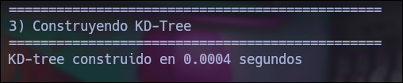
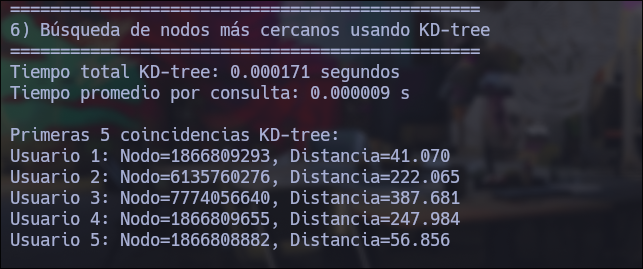
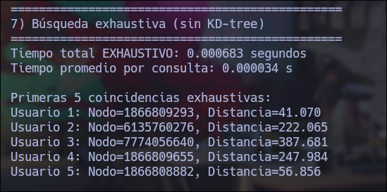
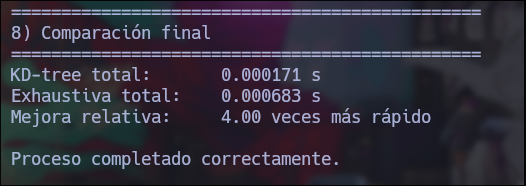
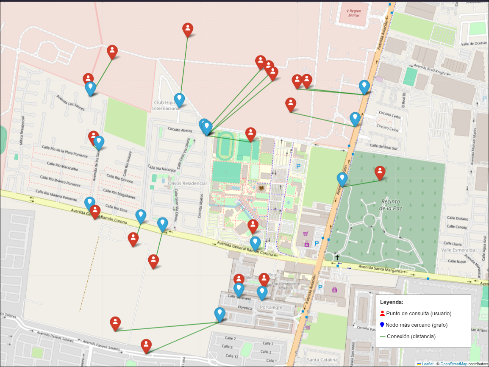

# **COMPONENTE 1 — Búsqueda óptimizada**
# 1.- Transformar latitud/longitud → coordenadas del grafo

### *Cómo hacerlo en Python con OSMnx*

```python
G_proj = ox.project_graph(G)        # convierte a coordenadas planas (metros)
```

# 2.- Construir el KD-tree



# 3.- Buscar el vértice más cercano con KD-tree

### *Seleccionar 20 coordenadas*
```
Punto 1: lat=20.723, lon=-103.4
Punto 2: lat=20.724, lon=-103.401
Punto 3: lat=20.725, lon=-103.402
Punto 4: lat=20.726, lon=-103.403
Punto 5: lat=20.727, lon=-103.404
Punto 6: lat=20.728, lon=-103.405
Punto 7: lat=20.729, lon=-103.406
Punto 8: lat=20.73, lon=-103.407
Punto 9: lat=20.731, lon=-103.408
Punto 10: lat=20.732, lon=-103.409
Punto 11: lat=20.733, lon=-103.41
Punto 12: lat=20.734, lon=-103.411
Punto 13: lat=20.735, lon=-103.412
Punto 14: lat=20.736, lon=-103.413
Punto 15: lat=20.737, lon=-103.414
Punto 16: lat=20.738, lon=-103.415
Punto 17: lat=20.739, lon=-103.416
Punto 18: lat=20.74, lon=-103.417
Punto 19: lat=20.741, lon=-103.418
Punto 20: lat=20.742, lon=-103.419
```
### *Tiempos necesarios para realizar la busqueda*



# 4.- Búsqueda exhaustiva (sin KD-tree)

### *Tiempos necesarios para realizar la busqueda*



### *Diferencias importantes en los tiempos de busquedas*



### *Mapa con coordenadas y vertices más cercanos*

